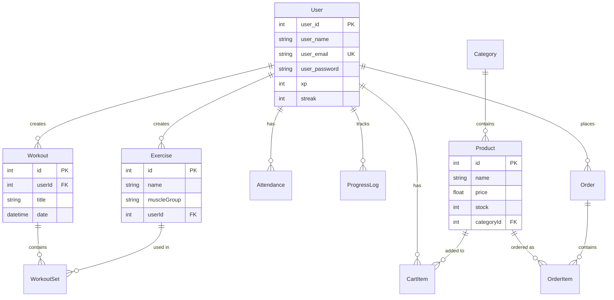

# 🏋️ FitFusion - Fitness Tracking & E-commerce Platform

A full-stack fitness tracking and e-commerce application built with the **MERN stack** (MongoDB replaced with PostgreSQL/Supabase).  
FitFusion connects fitness enthusiasts with workout tracking tools, progress monitoring, and a marketplace for fitness products.


---

## 🧩 Project Overview

FitFusion is a comprehensive fitness platform that combines:
- **Workout Tracking**: Log exercises, sets, reps, and track progress over time
- **Gamification**: XP points and streak system to keep users motivated
- **E-commerce**: Browse and purchase fitness products (supplements, equipment, apparel)
- **Progress Analytics**: Track body metrics (weight, body fat percentage)
- **Gym Attendance**: Check-in/check-out system with duration tracking

The platform uses JWT-based authentication with Google OAuth integration and Supabase (PostgreSQL) for cloud database storage.

---

## 🚀 Key Features / Modules

### 🔐 User Authentication & Authorization
- JWT-based authentication with secure password hashing (bcrypt)
- Google OAuth 2.0 integration for seamless login
- Protected routes with middleware
- Session management with token expiration

### 💪 Fitness Tracking System
- **Custom Exercise Library**: Create and manage personal exercises
- **Workout Logging**: Track sets, reps, weight, and RPE (Rate of Perceived Exertion)
- **Progress Tracking**: Monitor weight and body fat percentage over time
- **Workout History**: View past workouts with detailed set information
- **Gamification**: Earn XP points and maintain workout streaks

### 📅 Gym Attendance Management
- Check-in/Check-out system
- Automatic duration calculation
- Attendance history tracking
- Real-time status updates

### 🛒 E-commerce Platform
- Product catalog with categories (Supplements, Equipment, Apparel)
- Shopping cart management
- Order processing and history
- Inventory tracking
- Product search and filtering

### 📊 Analytics & Insights
- Progress visualization
- Workout frequency tracking
- Body metrics trends
- Purchase history

---

## 👥 User Roles

| Role | Description | Permissions |
|------|-------------|-------------|
| **User (Fitness Enthusiast)** | Tracks workouts, monitors progress, shops for products | Create account, log workouts, track progress, purchase products, manage cart |
| **Admin** (Future) | Manages platform, products, and users | Manage products, categories, view analytics, moderate content |

---

## 🖥️ Page / Screen List (Frontend)

### 🔐 Authentication
- Login / Register Page (Email/Password)
- Google OAuth Login/Signup
- Password Reset Page (Future)
- Session Management & JWT Tokens

### 👤 User Section
- **Dashboard**: Overview of recent workouts, streak, XP, and recommendations
- **Workout Logger**: Create and log new workouts
- **Exercise Library**: Browse and create custom exercises
- **Progress Tracker**: View body metrics over time
- **Attendance History**: Check-in/check-out records
- **Profile Page**: Edit user information and preferences

### 🛒 E-commerce Section
- **Product Catalog**: Browse all products with filters
- **Product Details**: Detailed product information
- **Shopping Cart**: Manage cart items
- **Checkout**: Place orders with shipping details
- **Order History**: View past purchases

### 📱 General
- **Home Page**: Landing page with features overview
- **About / Contact Page**
- **Navigation**: Responsive navbar with user menu

---

---

## 📊 Entity Relationship Diagram



---

## 🧰 Tech Stack

### Frontend
- **React** 19.1.1 - UI library
- **React Router** 6.30.2 - Client-side routing
- **Vite** 7.1.7 - Build tool and dev server
- **TailwindCSS** 4.1.16 - Utility-first CSS framework
- **Google OAuth** (@react-oauth/google) - OAuth integration

### Backend
- **Node.js** with **Express** 5.1.0 - Server framework
- **Prisma ORM** 6.18.0 - Database ORM
- **Supabase** - PostgreSQL cloud database
- **JWT** (jsonwebtoken) - Authentication tokens
- **bcrypt** - Password hashing
- **Zod** 4.1.12 - Schema validation

### Database
- **PostgreSQL** (via Supabase)
- **Prisma** for migrations and queries

### Authentication
- JWT-based authentication
- Google OAuth 2.0
- bcrypt password hashing

---

## 🚀 Quick Start

### Prerequisites
- Node.js v18+
- Supabase account ([free tier](https://supabase.com))

### Installation

1. **Clone the repository**
   ```bash
   git clone https://github.com/Dhruv-2403/FitFusion.git
   cd FitFusion
   ```

2. **Backend Setup**
   ```bash
   cd backend
   npm install
   ```

3. **Configure Environment**
   
   Copy `.env.supabase` to `.env` and add your Supabase credentials:
   ```env
   DATABASE_URL="postgresql://..."  # Transaction pooler (port 6543)
   DIRECT_URL="postgresql://..."     # Direct connection (port 5432)
   JWT_SECRET_KEY="your-secret-key"
   GOOGLE_CLIENT_ID="your-google-client-id"  # Optional
   ```

4. **Initialize Database**
   ```bash
   npx prisma db push
   npx prisma db seed
   ```
   
   This creates all tables and populates them with sample data!

5. **Start Backend**
   ```bash
   npm run dev
   ```
   Server runs on `http://localhost:3000`

6. **Frontend Setup**
   ```bash
   cd ../frontend
   npm install
   npm run dev
   ```
   Frontend runs on `http://localhost:5173`

---

## 🔄 Workflow (Simplified)

```
[User] → registers → logs workouts → tracks progress → earns XP & streaks
       ↳ browses products → adds to cart → places order
       ↳ checks in to gym → works out → checks out

[System] → calculates workout duration → updates streak → awards XP
         ↳ processes orders → updates inventory → sends confirmations
```

---

## 🧪 Testing the APIs

### Option 1: Use Seeded Data

After running `npx prisma db seed`, you can login with:

**Email:** `john@fitfusion.com`  
**Password:** `password123`

### Option 2: Postman/Thunder Client

Import and test all endpoints. See [`API_TESTING_GUIDE.md`](API_TESTING_GUIDE.md) for detailed documentation.

### Option 3: Prisma Studio

Visual database browser:
```bash
cd backend
npx prisma studio
```
Opens at `http://localhost:5555`

---

## 📡 API Endpoints

### Authentication
- `POST /api/users/signup` - Register new user
- `POST /api/users/login` - Login and get JWT token
- `GET /api/users/profile` - Get user profile (protected)
- `POST /api/auth/google` - Google OAuth login

### Fitness Tracking
- `POST /api/exercises` - Create custom exercise (protected)
- `GET /api/exercises` - Get user exercises (protected)
- `POST /api/workouts` - Log workout with sets (protected)
- `GET /api/workouts` - Get workout history (protected)
- `POST /api/attendance/checkin` - Check in to gym (protected)
- `POST /api/attendance/checkout` - Check out from gym (protected)
- `GET /api/attendance` - Get attendance history (protected)

### E-commerce
- `GET /api/products` - Get all products
- `GET /api/products/:id` - Get product details
- `POST /api/cart` - Add to cart (protected)
- `GET /api/cart` - Get cart items (protected)
- `PUT /api/cart/:id` - Update cart item (protected)
- `DELETE /api/cart/:id` - Remove from cart (protected)
- `POST /api/orders` - Create order (protected)
- `GET /api/orders` - Get order history (protected)

**Full API documentation:** [`API_TESTING_GUIDE.md`](API_TESTING_GUIDE.md)

---

## 📁 Project Structure

```
FitFusion/
├── frontend/              # React + Vite
│   ├── src/
│   │   ├── components/    # Reusable UI components
│   │   ├── pages/         # Page components
│   │   ├── context/       # React Context for state
│   │   └── App.jsx        # Main app component
│   ├── package.json
│   └── vite.config.js
│
├── backend/               # Express + Prisma
│   ├── src/
│   │   ├── controllers/   # Business logic
│   │   │   ├── userController.js
│   │   │   ├── exerciseController.js
│   │   │   ├── workoutController.js
│   │   │   ├── attendanceController.js
│   │   │   ├── productController.js
│   │   │   ├── cartController.js
│   │   │   └── orderController.js
│   │   ├── routes/        # API routes
│   │   ├── middleware/    # Auth middleware
│   │   ├── validation/    # Zod schemas
│   │   └── index.js       # Server entry
│   ├── prisma/
│   │   └── seed.js        # Sample data
│   ├── schema.prisma      # Database schema
│   └── package.json
│
├── API_TESTING_GUIDE.md   # Detailed API docs
└── README.md              # This file
```

---

## 🎯 Expected Outcomes

- ✅ A fully functional MERN-based Fitness & E-commerce Platform
- ✅ Multi-module application (Fitness + Shopping)
- ✅ Live demo showcasing full-stack CRUD operations
- ✅ Gamification system with XP and streaks
- ✅ Responsive design with TailwindCSS
- ✅ Secure authentication (JWT + OAuth)
- ✅ Cloud database with Supabase
- ✅ Real-world workflow demonstration
- ✅ Portfolio-grade project for full-stack developer roles

---

## 🔧 Environment Variables

```env
# Supabase Database
DATABASE_URL="postgresql://..."      # Pooler connection
DIRECT_URL="postgresql://..."        # Direct connection

# Authentication
JWT_SECRET_KEY="your-secret-key"
JWT_EXPIRES_IN="7d"

# Google OAuth (optional)
GOOGLE_CLIENT_ID="your-google-client-id"
```

---

## 📊 Sample Data

The seed file (`backend/prisma/seed.js`) creates:
- **2 Users** (john@fitfusion.com, jane@fitfusion.com)
- **5 Exercises** (Bench Press, Squat, Deadlift, Overhead Press, Pull-ups)
- **3 Workouts** with multiple sets
- **2 Attendance** records with check-in/check-out
- **2 Progress Logs** with body metrics
- **3 Product Categories** (Supplements, Equipment, Apparel)
- **5 Products** with stock and pricing
- **2 Cart Items**
- **2 Orders** with order items

Run `npx prisma db seed` anytime to reset with fresh sample data!

---

## 🌟 Future Enhancements

- [ ] **Social Features**: Follow friends, share workouts
- [ ] **AI Workout Recommendations**: Personalized workout plans based on history
- [ ] **Nutrition Tracking**: Calorie and macro tracking
- [ ] **Workout Templates**: Pre-built workout programs
- [ ] **Progress Photos**: Upload and track transformation photos
- [ ] **Leaderboards**: Compete with other users
- [ ] **Mobile App**: React Native version
- [ ] **Wearable Integration**: Sync with Fitbit, Apple Watch
- [ ] **Video Tutorials**: Exercise demonstration videos
- [ ] **Community Forum**: Discussion boards for fitness topics
- [ ] **Premium Subscription**: Advanced features and analytics
- [ ] **Admin Dashboard**: Manage users, products, and analytics
- [ ] **Real-time Notifications**: Push notifications for achievements
- [ ] **Payment Gateway**: Stripe/PayPal integration for e-commerce

---

## 📊 View Your Data

### Supabase Dashboard
1. Go to [supabase.com](https://supabase.com)
2. Open your project
3. Click **Table Editor**
4. Browse all tables

### Prisma Studio (Local)
```bash
npx prisma studio
```
Opens at `http://localhost:5555`

---

## 🤝 Contributing

1. Fork the repository
2. Create a feature branch (`git checkout -b feature/amazing-feature`)
3. Commit your changes (`git commit -m 'Add amazing feature'`)
4. Push to the branch (`git push origin feature/amazing-feature`)
5. Open a Pull Request

---

## 📄 License

This project is licensed under the ISC License.

---

## 👨‍💻 Author

**Dhruv Sareen**  
GitHub: [@Dhruv-2403](https://github.com/Dhruv-2403)

---

## 📚 Additional Documentation

- **API Testing Guide:** [`API_TESTING_GUIDE.md`](API_TESTING_GUIDE.md)
- **E-commerce API Details:** [`backend/ECOMMERCE_API.md`](backend/ECOMMERCE_API.md)
- **OAuth Testing:** [`backend/TEST_OAUTH.md`](backend/TEST_OAUTH.md)

---

**⭐ If you found this project helpful, please give it a star!**
